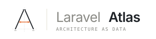

<p align="center">
  <picture>
    <source media="(prefers-color-scheme: dark)" srcset="art/logo-wide-dark.svg">
    
  </picture>
</p>

<p align="center">
  <a href="https://github.com/lucasp1337/laravel-loom/actions/workflows/run-tests.yml"></a>
  <a href="https://github.com/lucasp1337/laravel-loom/actions/workflows/phpstan.yml"></a>
  <a href="https://codecov.io/gh/lucasp1337/laravel-loom"></a>
  <a href="LICENSE.md"></a>
</p>

# Laravel Loom

*Architecture as data.*

Loom statically analyzes a Laravel app's event-driven primitives and writes a deterministic JSON file: every event, listener, observer, job, schedule, mailable, notification, and dispatch site, each with its file path and line number. It reads source with `nikic/php-parser` — no app boot, no runtime tracing, no `vendor/` required — so it sees what's actually in your code, not just what Laravel happened to register at boot.

```bash
composer require lucasp1337/laravel-loom --dev
php artisan loom:scan          # writes storage/loom/index.json
```

## Usage

```bash
php artisan loom:scan               # writes storage/loom/index.json
php artisan loom:show               # prints the index
php artisan loom:show OrderPlaced   # filters by FQCN substring
```

Add `storage/loom/index.json` to `.gitignore` if you don't want to commit it.

## What it finds

Click any item to see what gets picked up.

<details>
<summary><strong>Events</strong> — <code>app/Events/**</code>, plus any class dispatched via <code>event()</code> / <code>Event::dispatch()</code></summary>

```php
namespace App\Events;

class OrderPlaced {}   // any class under app/Events/

// ...or any class dispatched statically, wherever it lives:
event(new OrderPlaced($order));
Event::dispatch(new OrderPlaced($order));
OrderPlaced::dispatch($order);   // counts as an event when it resolves under app/Events/
```

</details>

<details>
<summary><strong>Listeners</strong> — auto-discovery, <code>$listen</code> arrays, <code>Event::listen()</code>, and subscribers</summary>

```php
// Auto-discovered from the typed handle() argument
class SendOrderConfirmation
{
    public function handle(OrderPlaced $event): void {}
}

// $listen array on EventServiceProvider
protected $listen = [
    OrderPlaced::class => [SendOrderConfirmation::class],
];

// Event::listen() anywhere under app/
Event::listen(OrderPlaced::class, SendOrderConfirmation::class);

// Subscriber
class OrderSubscriber
{
    public function subscribe(Dispatcher $events): array
    {
        return [OrderPlaced::class => 'onOrderPlaced'];
    }
}
```

</details>

<details>
<summary><strong>Closure listeners</strong> — closures registered as listeners, in their own section</summary>

```php
Event::listen(OrderPlaced::class, function (OrderPlaced $event) {
    // captured in closure_listeners[], not listeners[]
});
```

</details>

<details>
<summary><strong>Observers</strong> — <code>Model::observe()</code>, <code>#[ObservedBy]</code>, and <code>eloquent.*</code> model events</summary>

```php
#[ObservedBy(UserObserver::class)]
class User extends Model {}

// ...or registered imperatively
User::observe(UserObserver::class);

// ...or via an eloquent.* model event
Event::listen('eloquent.created: '.User::class, $callback);
```

</details>

<details>
<summary><strong>Jobs</strong> — <code>app/Jobs/**</code>, plus any class dispatched via <code>dispatch()</code> / <code>X::dispatch()</code>, with queue config</summary>

```php
class ProcessOrder implements ShouldQueue   // any class under app/Jobs/
{
    public $connection = 'redis';   // queue config read from properties
    public $queue = 'high';
    public $tries = 3;
}

// ...or any class dispatched as a job (located via PSR-4, so DDD layouts work):
dispatch(new ProcessOrder($order));
ProcessOrder::dispatch($order);
Bus::dispatch(new ProcessOrder($order));
```

</details>

<details>
<summary><strong>Schedule</strong> — <code>Kernel::schedule()</code>, <code>bootstrap/app.php</code>, and <code>Schedule::*</code> chains, normalized to cron</summary>

```php
// In Kernel::schedule(), bootstrap/app.php withSchedule(), or a Schedule:: chain under app/
$schedule->command('mail:send')->dailyAt('13:00')->weekdays();
$schedule->job(new ProcessOrder)->everyFiveMinutes();
Schedule::call(fn () => cleanup())->hourly();
```

</details>

<details>
<summary><strong>Mailables</strong> — <code>app/Mail/**</code>, plus <code>Mail::send()</code> and <code>Mail::to()->send()</code> chains, with queue config</summary>

```php
class OrderShipped extends Mailable implements ShouldQueue {}   // any class under app/Mail/

// ...or any class sent via Mail::
Mail::to($user)->send(new OrderShipped($order));
Mail::queue(new OrderShipped($order));
```

</details>

<details>
<summary><strong>Notifications</strong> — <code>app/Notifications/**</code>, plus <code>notify()</code> / <code>Notification::send()</code>, with channels</summary>

```php
class InvoicePaid extends Notification   // any class under app/Notifications/
{
    public function via($notifiable): array
    {
        return ['mail', 'database', 'slack'];   // channels read from a static via() literal
    }
}

// ...or any class sent via notify()/Notification::
$user->notify(new InvoicePaid($invoice));
Notification::send($users, new InvoicePaid($invoice));
```

</details>

<details>
<summary><strong>Dispatches</strong> — every handler body, cross-linked back to the listener, observer, or job it runs in</summary>

```php
class SendOrderConfirmation
{
    public function handle(OrderPlaced $event): void
    {
        // attributed to this listener as listeners[].dispatches
        event(new OrderConfirmationSent($event->order));
    }
}
```

</details>

Dynamic calls Loom can't resolve statically (`event($var)`, container lookups) land in `unresolved_dispatches[]` with a reason and a `file:line` rather than being dropped silently. Per-scanner behavior and limitations live in [docs/scanners/](docs/scanners/).

## Sample output

<details>
<summary>Click to expand a representative scan against a small Laravel 13 app</summary>

```json
{
  "loom_version": "0.2.0",
  "scanned_at": "2026-05-16T19:25:54Z",
  "laravel_version": "13.7",
  "stats": {
    "events": 1,
    "listeners": 1,
    "observers": 1,
    "jobs": 1,
    "scheduled": 1,
    "mailables": 1,
    "notifications": 1,
    "unresolved_dispatches": 1,
    "closure_listeners": 1
  },
  "events": [
    {
      "id": "App\\Events\\OrderPlaced",
      "fqcn": "App\\Events\\OrderPlaced",
      "kind": "class",
      "file": "app/Events/OrderPlaced.php",
      "line": 11,
      "dispatched_from": [
        { "file": "app/Services/Checkout.php", "line": 87, "method": "App\\Services\\Checkout::finalize" }
      ],
      "handled_by": [
        { "listener": "App\\Listeners\\SendOrderConfirmation", "method": "handle" }
      ]
    }
  ],
  "model_events": [
    {
      "id": "eloquent.creating: App\\Models\\User",
      "kind": "model_event",
      "model": "App\\Models\\User",
      "event": "creating",
      "handled_by": ["App\\Observers\\UserObserver::creating"]
    }
  ],
  "listeners": [
    {
      "fqcn": "App\\Listeners\\SendOrderConfirmation",
      "file": "app/Listeners/SendOrderConfirmation.php",
      "line": 14,
      "handles": [
        { "event": "App\\Events\\OrderPlaced", "method": "handle" }
      ],
      "registration": "auto_discovered",
      "queued": true,
      "dispatches": [
        {
          "target": "App\\Events\\OrderConfirmationSent",
          "kind": "event",
          "confidence": "high",
          "file": "app/Listeners/SendOrderConfirmation.php",
          "line": 31
        }
      ]
    }
  ],
  "observers": [
    {
      "fqcn": "App\\Observers\\UserObserver",
      "file": "app/Observers/UserObserver.php",
      "line": 9,
      "observes": "App\\Models\\User",
      "registration": "attribute",
      "hooks": ["created", "deleted", "updated"],
      "dispatches": []
    }
  ],
  "jobs": [
    {
      "fqcn": "App\\Jobs\\ProcessOrder",
      "file": "app/Jobs/ProcessOrder.php",
      "line": 14,
      "queued": true,
      "queue_config": {
        "connection": "redis",
        "queue": "high",
        "delay": null,
        "tries": 3,
        "timeout": 60,
        "backoff": null
      },
      "dispatched_from": [
        { "file": "app/Services/Checkout.php", "line": 91, "method": "App\\Services\\Checkout::finalize" }
      ],
      "dispatches": []
    }
  ],
  "scheduled": [
    {
      "kind": "command",
      "target": "mail:send {--queue=default}",
      "cron": "0 13 * * *",
      "timezone": "America/Chicago",
      "without_overlapping": true,
      "on_one_server": false,
      "run_in_background": false,
      "constraints": ["weekdays"],
      "file": "app/Console/Kernel.php",
      "line": 28
    }
  ],
  "mailables": [
    {
      "fqcn": "App\\Mail\\OrderShipped",
      "file": "app/Mail/OrderShipped.php",
      "line": 18,
      "queued": true,
      "queue_config": {
        "connection": null,
        "queue": "mail",
        "delay": null,
        "tries": 3,
        "timeout": null,
        "backoff": null
      },
      "sent_from": [
        { "file": "app/Services/Checkout.php", "line": 94, "method": "App\\Services\\Checkout::finalize" }
      ]
    }
  ],
  "notifications": [
    {
      "fqcn": "App\\Notifications\\InvoicePaid",
      "file": "app/Notifications/InvoicePaid.php",
      "line": 22,
      "queued": true,
      "queue_config": {
        "connection": null,
        "queue": "notifications",
        "delay": null,
        "tries": null,
        "timeout": null,
        "backoff": null
      },
      "channels": ["mail", "database", "slack"],
      "channels_dynamic": false,
      "notified_from": [
        { "file": "app/Services/Billing.php", "line": 51, "method": "App\\Services\\Billing::charge" }
      ]
    }
  ],
  "unresolved_dispatches": [
    {
      "file": "app/Services/Notifier.php",
      "line": 42,
      "expression": "event($eventClass)",
      "reason": "dynamic_class_name"
    }
  ],
  "closure_listeners": [
    {
      "event": "App\\Events\\OrderPlaced",
      "file": "app/Providers/EventServiceProvider.php",
      "line": 38,
      "registration": "event_listen_call",
      "queued": false,
      "dispatches": []
    }
  ]
}
```

</details>

The JSON shape is defined by `schema/loom-index.schema.json` and validated on every scan.

## Requirements

- PHP **8.3+**
- Laravel **11, 12, or 13**

## Local development

Running the package needs only PHP 8.3+, but the test suite needs `ext-mbstring`, `ext-xml`, `ext-dom`, and `ext-xmlwriter`. A `Dockerfile` and `Justfile` are provided so you can run the full toolchain without those extensions on your host:

```bash
just build    # build the Docker dev image (once)
just install  # composer install
just check    # PHPStan + Pint --test + Pest
just coverage # Pest with per-file coverage
```

See [docs/contributing.md](docs/contributing.md) for the full list of recipes.

## Documentation

- [Architecture](docs/architecture.md) — pipeline, scanner contract, cross-link pass
- [Schema](docs/schema.md) — JSON schema reference
- [Scanners](docs/scanners/) — per-scanner behavior, edge cases, known limitations
- [Contributing](docs/contributing.md) — toolchain, Docker workflow, how to add a scanner

## License

The MIT License (MIT). See [LICENSE.md](LICENSE.md).
