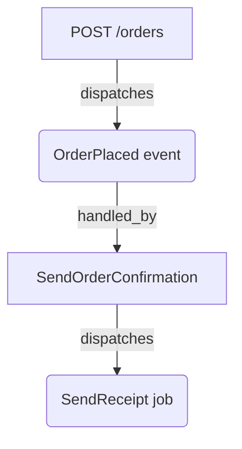

# The index

Someone who has run `loom:scan` and opened the JSON, and now wants to read it without the schema open.

A scan writes one JSON document, `storage/loom/index.json`. This page shows how to read it; the [schema](../reference/schema.md) has the field-by-field contract.

## The shape of the document

The index opens with metadata and a `stats` block, then carries one array per primitive:

```json
{
  "schema_version": "1.0",
  "loom_version": "...",
  "scanned_at": "2026-05-16T19:25:54Z",
  "laravel_version": "13.7",
  "stats": { "events": 1, "listeners": 1, "routes": 1, "...": "..." },
  "events": [ { "...": "..." } ],
  "model_events": [ { "...": "..." } ],
  "listeners": [ { "...": "..." } ],
  "closure_listeners": [ { "...": "..." } ],
  "jobs": [ { "...": "..." } ],
  "observers": [ { "...": "..." } ],
  "scheduled": [ { "...": "..." } ],
  "routes": [ { "...": "..." } ],
  "mailables": [ { "...": "..." } ],
  "notifications": [ { "...": "..." } ],
  "unresolved_dispatches": [ { "...": "..." } ]
}
```

All keys are always present. Empty arrays are valid; a `null` array never is. `loom_version` is the version of Loom that wrote the file, and `stats` counts the entries in each section.

Entries are sorted, so two scans of the same source produce byte-identical files. That's what makes [`loom:diff`](../guides/gate-your-ci.md) stable and order-independent, and it's why committing the index gives you readable diffs.

## Reading a relationship

The interesting part is how entries point at each other. Every relationship is stored once, on whichever side owns it:

- A **route** lists what its controller method fires in `dispatches`.
- An **event** lists its handlers in `handled_by`, each `{listener, method}`.
- A **listener**, **job**, **observer** or **closure listener** lists what it fires in `dispatches`, each `{target, kind, confidence, file, line}`.
- An **event** or **job** lists where it's fired from in `dispatched_from`. A **mailable** uses `sent_from`, and a **notification** uses `notified_from`. Each item is a call site: `{file, line, method}`.

To answer "who handles this event?", read its `handled_by`. To answer "where is this job dispatched?", read its `dispatched_from`. You never reconcile two copies of the same fact.

## A worked example

Consider one flow: `POST /orders` runs `OrderController::store`, which dispatches `OrderPlaced`. `SendOrderConfirmation` handles it and dispatches a queued `SendReceipt` job.



The snippets below come from a real scan of that flow, trimmed to the fields that carry the links. Real entries have a few more.

The route records the event its controller method fires:

```json
{
  "method": "POST",
  "uri": "/orders",
  "name": "orders.store",
  "controller_fqcn": "App\\Http\\Controllers\\OrderController",
  "controller_method": "store",
  "file": "routes/web.php",
  "line": 6,
  "dispatches": [
    {
      "target": "App\\Events\\OrderPlaced",
      "kind": "event",
      "confidence": "high",
      "file": "app/Http/Controllers/OrderController.php",
      "line": 11
    }
  ]
}
```

The event records who handles it and where it's dispatched from:

```json
{
  "id": "App\\Events\\OrderPlaced",
  "file": "app/Events/OrderPlaced.php",
  "line": 5,
  "dispatched_from": [
    { "file": "app/Http/Controllers/OrderController.php", "line": 11, "method": "App\\Http\\Controllers\\OrderController::store" }
  ],
  "handled_by": [
    { "listener": "App\\Listeners\\SendOrderConfirmation", "method": "handle" }
  ]
}
```

The listener records the job it dispatches:

```json
{
  "fqcn": "App\\Listeners\\SendOrderConfirmation",
  "file": "app/Listeners/SendOrderConfirmation.php",
  "line": 8,
  "handles": [ { "event": "App\\Events\\OrderPlaced", "method": "handle" } ],
  "registration": "auto_discovered",
  "queued": false,
  "dispatches": [
    {
      "target": "App\\Jobs\\SendReceipt",
      "kind": "job",
      "confidence": "high",
      "file": "app/Listeners/SendOrderConfirmation.php",
      "line": 12
    }
  ]
}
```

The job records where it's dispatched from, and the queue settings it declares:

```json
{
  "fqcn": "App\\Jobs\\SendReceipt",
  "file": "app/Jobs/SendReceipt.php",
  "line": 9,
  "queued": true,
  "queue_config": { "connection": null, "queue": "mail", "delay": null, "tries": 3, "timeout": null, "backoff": null },
  "dispatched_from": [
    { "file": "app/Listeners/SendOrderConfirmation.php", "line": 12, "method": "App\\Listeners\\SendOrderConfirmation::handle" }
  ]
}
```

Follow the links. The route's `dispatches` names `OrderPlaced`. `OrderPlaced.handled_by` names `SendOrderConfirmation`, whose `dispatches` names `SendReceipt`. Going back, `SendReceipt.dispatched_from` points at `SendOrderConfirmation::handle`, and `OrderPlaced.dispatched_from` points at `OrderController::store`. The same flow read forward and backward, with each fact stored once.

!!! note "Closure listeners sit outside this chain"
    If a provider also registers a closure for `OrderPlaced`, it doesn't appear in `handled_by`. It has its own entry under `closure_listeners`, keyed by the event. See [what Loom sees](what-loom-sees.md) for why.

## Keeping the file

Decide whether `storage/loom/index.json` is a build artifact or a record. Add it to `.gitignore` if you only read it locally. Commit it if you want a baseline that [`loom:diff` and `loom:check`](../guides/gate-your-ci.md) can compare a branch against.

## Where next

- [Schema](../reference/schema.md): the full contract for every section.
- [PHP API](../reference/php-api.md): read the index as typed objects instead of arrays.
- [What Loom sees](what-loom-sees.md): what each section means and what Loom can't resolve.
