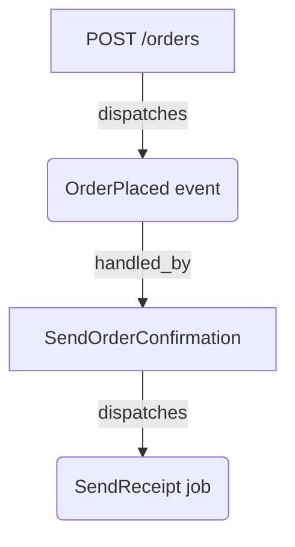

# The index

For someone who has run `loom:scan`, opened the JSON and wants to read it without the schema open. A scan writes one document, `storage/loom/index.json`; the [schema](../reference/schema.md) is the field-by-field contract.

## The shape

The index opens with `schema_version`, `loom_version`, `scanned_at`, `laravel_version` and a `stats` block counting each section, then carries one array per primitive: `events`, `model_events`, `listeners`, `closure_listeners`, `jobs`, `observers`, `scheduled_tasks`, `routes`, `mailables`, `notifications` and `unresolved_dispatches`. All keys are always present, and empty arrays are valid.

Entries are sorted, so two scans of the same source give byte-identical files apart from `scanned_at`. That is what makes [`loom:diff`](../guides/gate-your-ci.md) stable and committed indexes readable.

## Reading a relationship

Every relationship is stored once, on the side that owns it:

- A **route** lists what its controller method fires in `dispatches`.
- An **event** lists its handlers in `handled_by`, each `{listener, method}`.
- A **listener**, **job**, **observer** or **closure listener** lists what it fires in `dispatches`, each `{target, kind, confidence, file, line}`.
- An **event** or **job** lists where it is fired from in `dispatched_from`; a **mailable** uses `sent_from` and a **notification** `notified_from`. Each item is `{file, line, method}`.

To ask "who handles this event?", read its `handled_by`. To ask "where is this job dispatched?", read its `dispatched_from`. You never reconcile two copies of a fact.

## A worked example

`POST /orders` runs `OrderController::store`, which dispatches `OrderPlaced`. `SendOrderConfirmation` handles it and dispatches a queued `SendReceipt` job.


```mermaid
flowchart TD
    R[POST /orders] -->|dispatches| E(OrderPlaced event)
    E -->|handled_by| L[SendOrderConfirmation]
    L -->|dispatches| J(SendReceipt job)
```

Trimmed to the link-carrying fields, the entries read:

```json
{ "route": { "method": "POST", "uri": "/orders", "controller_fqcn": "App\\Http\\Controllers\\OrderController", "controller_method": "store",
    "dispatches": [{ "target": "App\\Events\\OrderPlaced", "kind": "event", "confidence": "high", "file": "app/Http/Controllers/OrderController.php", "line": 11 }] },
  "event": { "id": "App\\Events\\OrderPlaced",
    "dispatched_from": [{ "file": "app/Http/Controllers/OrderController.php", "line": 11, "method": "App\\Http\\Controllers\\OrderController::store" }],
    "handled_by": [{ "listener": "App\\Listeners\\SendOrderConfirmation", "method": "handle" }] },
  "listener": { "fqcn": "App\\Listeners\\SendOrderConfirmation", "registration": "auto_discovered",
    "handles": [{ "event": "App\\Events\\OrderPlaced", "method": "handle" }],
    "dispatches": [{ "target": "App\\Jobs\\SendReceipt", "kind": "job", "confidence": "high", "file": "app/Listeners/SendOrderConfirmation.php", "line": 12 }] },
  "job": { "fqcn": "App\\Jobs\\SendReceipt", "queued": true,
    "queue_config": { "connection": null, "queue": "mail", "delay": null, "tries": 3, "timeout": null, "backoff": null },
    "dispatched_from": [{ "file": "app/Listeners/SendOrderConfirmation.php", "line": 12, "method": "App\\Listeners\\SendOrderConfirmation::handle" }] } }
```

Forward: the route's `dispatches` names `OrderPlaced`, `handled_by` names `SendOrderConfirmation`, whose `dispatches` names `SendReceipt`. Backward: `SendReceipt.dispatched_from` points at `SendOrderConfirmation::handle` and `OrderPlaced.dispatched_from` at `OrderController::store`.

!!! note "Closure listeners sit outside this chain"
    A closure registered for `OrderPlaced` has no `handled_by` entry. It has its own entry under `closure_listeners`, keyed by the event; see [what Loom sees](what-loom-sees.md).

## Keeping the file

Add `storage/loom/index.json` to `.gitignore` if you only read it locally. Commit it if you want a baseline that [`loom:diff` and `loom:check`](../guides/gate-your-ci.md) can compare a branch against. To read it as typed objects, see the [PHP API](../reference/php-api.md).
