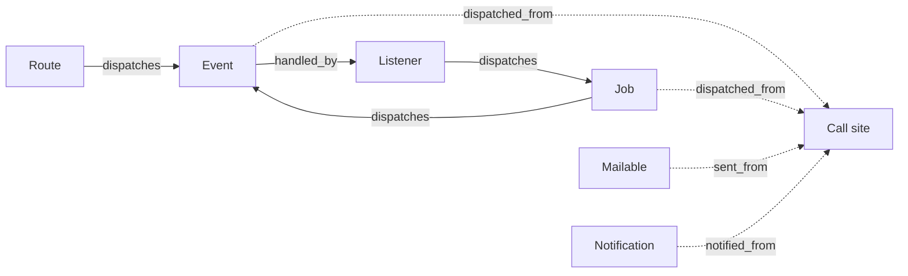

# What Loom sees

Someone who knows Laravel events, has scanned an app, and now wants to know what ended up in the index and what didn't.

## The wiring problem

Take one event in a checkout app. `OrderController::store` fires it:

```php
event(new OrderPlaced($order->id));
```

`SendOrderConfirmation` reacts to it. Nothing registers that listener; Laravel discovers it from the type hint:

```php
public function handle(OrderPlaced $event): void
{
    SendReceipt::dispatch($event->orderId);
}
```

A provider adds a second reaction as a closure:

```php
Event::listen(OrderPlaced::class, function (OrderPlaced $event) {
    logger('order placed');
});
```

Three files, three registration styles, and no place that says "these are the reactions to `OrderPlaced`". Grepping finds the `event()` call and the closure, but not the listener, because its only link to the event is a type hint. That works fine until the app has a few hundred events.

Loom reads the source, follows each of those links, and writes them into one index. It never boots your app, so it records what your code says, not what a particular request did.

## What Loom records

Each primitive gets its own section in the index, and every entry carries at least a file and a line. The [schema](../reference/schema.md) has the exact fields; this page covers what each section means and where the edges are.

**Events.** A class Loom finds under `app/Events/`, or any class you dispatch with `event()`, `Event::dispatch()` or `OrderPlaced::dispatch()`. Each event lists the listeners that handle it and the sites that dispatch it.

**Listeners.** A class that reacts to an event. Loom finds them four ways: typed `handle()` auto-discovery, the `$listen` array on a provider, `Event::listen()` calls (including a dispatcher resolved from the container), and subscribers. In `$listen` and `Event::listen()` a listener can be written as `SendReceipt::class`, `[SendReceipt::class, 'handle']`, `Closure::fromCallable([...])` or the first-class callable `SendReceipt::handle(...)`. They all link the same way.

**Closure listeners.** A closure or arrow function passed to `Event::listen()` has no class name, so it lives in its own `closure_listeners` section, with the event it handles and where the closure starts and ends.

**Observers and model events.** Loom finds observers through `Model::observe()`, the `#[ObservedBy]` attribute and `eloquent.*` listeners. It records the model and the lifecycle hooks the observer implements. The lifecycle events themselves show up as `model_events` entries that link a model and an event such as `created` back to its handlers.

**Jobs.** A class under `app/Jobs/`, or any class you dispatch with `dispatch()`, `Bus::dispatch()` or `SendReceipt::dispatch()`. Loom locates dispatched classes through your PSR-4 autoload map, so domain-driven layouts work. It records whether the job is queued and the queue settings the class declares.

**Mailables and notifications.** Classes under `app/Mail/` and `app/Notifications/`, plus anything sent with `Mail::to()->send()`, `notify()` or `Notification::send()`. Notifications also record their delivery channels when `via()` returns a literal array.

**Scheduled tasks.** Entries from `Kernel::schedule()`, `withSchedule()` in `bootstrap/app.php` and `Schedule::*` chains. Frequencies are normalized to a five-field cron expression.

**Routes.** Every registration in `routes/*.php`: `Route::get()` and the other verbs, `Route::match()`, `Route::any()`, and the routes a `Route::resource()` expands into. Each route records its method, URI, name, controller action and middleware, and the events and jobs its controller method dispatches. That last link is what lets you start from a URL and end at an event.

**Dispatch sites.** Every call that fires an event, job, mailable or notification. They aren't a section of their own. Each one appears on the thing it fires, as `dispatched_from`, `sent_from` or `notified_from`, and on the class or route that contains the call, as `dispatches`.

## How the sections connect

Loom finishes reading every file before it links anything, so a listener can point at an event that was scanned after it. Each relationship is stored on one side only, and [the index](the-index.md) shows how to read it from both directions.



Solid edges are stored on the source (a route, listener or job lists what it dispatches). Dashed edges are the reverse, stored on the target so you can ask "who fires this?" without scanning every entry.

## What Loom can't see

Some dispatches can't be resolved from source. `event($class)` could fire anything, a container lookup returns whatever is bound at runtime, and a class name built by string interpolation or picked in a conditional isn't a name yet.

Loom doesn't drop these. Each goes into `unresolved_dispatches` with the expression, a file and line, and a reason: `dynamic_class_name`, `container_resolution`, `string_concatenation` or `conditional_dispatch`.

```json
{
  "file": "app/Services/Notifier.php",
  "line": 42,
  "expression": "event($eventClass)",
  "reason": "dynamic_class_name"
}
```

Read that as "an event fires here and I can't tell which". A growing list means your architecture is getting harder to map, and [`loom:check`](../guides/gate-your-ci.md) can watch that count.

!!! warning "An empty `handled_by` isn't always a dead event"
    A closure listener has no class to point at, so the event lists no handler for it. Check `closure_listeners` for the same event before you call it unhandled. The reverse holds too: dispatches inside a closure have no back-edge from the target.

!!! warning "Vendor parents are opaque"
    Loom doesn't read `vendor/`. A job that gets `ShouldQueue` from a parent class in a package reports `queued: false`, and a notification that inherits `via()` from one reports no channels.

!!! note "Dispatch attribution is per class"
    For listeners, jobs and closures, a dispatch is attributed to the whole class, not to the method it sits in. Routes are the exception: they record dispatches per controller method.

If something you expected is missing or wrong, [Why was my code missed?](../guides/why-was-my-code-missed.md) goes symptom by symptom.
