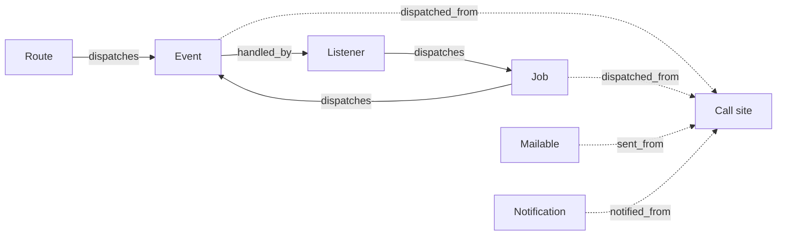

# What Loom sees

For someone who knows Laravel events, has scanned an app, and wants to know what ended up in the index and what didn't.

## The wiring problem

One event in a checkout app. `OrderController::store` fires it with `event(new OrderPlaced($order->id))`. `SendOrderConfirmation` reacts to it, and nothing registers that listener: Laravel discovers it from the type hint on `handle(OrderPlaced $event)`. A provider adds a second reaction as a closure with `Event::listen(OrderPlaced::class, function (...) {...})`.

Three files, three registration styles, and no place that says "these are the reactions to `OrderPlaced`". Grepping finds the `event()` call and the closure, but not the listener, whose only link is a type hint. Loom reads the source, follows each link and writes them into one index. It never boots your app, so it records what your code says, not what a request did.

## What Loom records

Each primitive gets its own section, and every entry carries a file and a line. The [schema](../reference/schema.md) has the fields; the exact code shapes are in [What Loom detects](../reference/what-loom-detects.md).

- **Events**: classes under `app/Events/`, classes you dispatch with `event()`, `Event::dispatch()` or `OrderPlaced::dispatch()`, and classes a model names in `$dispatchesEvents`. Each lists its handlers and dispatch sites.
- **Listeners**: found by auto-discovery of `handle*` and `__invoke` methods, the `$listen` array, `Event::listen()` calls (including a container-resolved dispatcher) and subscribers.
- **Closure listeners**: a closure or arrow function has no class name, so it has its own section with the event and its start and end lines.
- **Observers and model events**: through `Model::observe()`, `#[ObservedBy]` and `eloquent.*` listeners. Lifecycle events appear as `model_events` linking a model and an event such as `created` to its handlers.
- **Jobs**: classes under `app/Jobs/` and classes you dispatch, located through your PSR-4 map so domain layouts work, with `queued` and the declared queue settings.
- **Mailables and notifications**: classes under `app/Mail/` and `app/Notifications/` and anything sent with `Mail::to()->send()`, `notify()` or `Notification::send()`; notifications also record literal `via()` channels.
- **Scheduled tasks**: `Kernel::schedule()`, `withSchedule()` and `Schedule::*` chains, with frequencies normalised to a five-field cron.
- **Routes**: `routes/*.php` registrations and expanded resources, with controller action, middleware and the events and jobs the controller method dispatches, so you can start from a URL and end at an event.
- **Dispatch sites**: not a section. Each appears on the thing it fires (`dispatched_from`, `sent_from`, `notified_from`) and on the class or route that contains the call (`dispatches`).

## How the sections connect

Loom reads every file before it links anything, and each relationship is stored on one side only ([the index](the-index.md) shows how to read both directions).

```mermaid
flowchart LR
    Route -->|dispatches| Event
    Event -->|handled_by| Listener
    Listener -->|dispatches| Job
    Job -->|dispatches| Event
    Event -.->|dispatched_from| Site[Call site]
    Job -.->|dispatched_from| Site
    Mailable -.->|sent_from| Site
    Notification -.->|notified_from| Site
```

Solid edges are stored on the source; dashed edges are the reverse, stored on the target so "who fires this?" needs no full scan.

## What Loom can't see

`event($class)` could fire anything, a container lookup returns whatever is bound at runtime, and a class name built by interpolation isn't a name yet. Loom doesn't drop these: each goes into `unresolved_dispatches` with the expression, file, line and a reason (`dynamic_class_name`, `container_resolution`, `string_concatenation` or `conditional_dispatch`). Read an entry as "an event fires here and I can't tell which". [`loom:check`](../guides/gate-your-ci.md) can watch that count.

!!! warning "An empty `handled_by` isn't always a dead event"
    A closure listener has no class to point at. Check `closure_listeners` for the event before calling it unhandled. A dispatch inside a closure listener has no back-edge from its target either; a route closure is the exception, and its event lists the route.

!!! warning "Vendor parents are opaque"
    Loom doesn't read `vendor/`. A job that gets `ShouldQueue` from a package parent reports `queued: false`, and a notification that inherits `via()` reports no channels.

!!! note "Dispatches are attributed per class"
    For listeners, jobs and observers a dispatch belongs to the class, not the method it sits in. Routes record per controller method or closure.

If something you expected is missing, [Why was my code missed?](../guides/why-was-my-code-missed.md) goes symptom by symptom.
