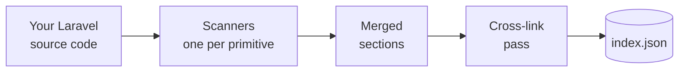

# Laravel Loom

*Architecture as data.*

Loom statically analyzes a Laravel app's event-driven primitives and writes a deterministic JSON file: every event, listener, observer, job, schedule, mailable, notification, and dispatch site, each with its file path and line number. It reads your source with `nikic/php-parser` — no app boot, no runtime tracing, no `vendor/` required — so it sees what's actually in your code, not just what Laravel happened to register at boot.

It's for anyone who needs a reliable map of how a Laravel app is wired: developers tracing a feature, CI checks watching for architectural drift, and AI agents that need context about an event-driven codebase.

## The problem

Laravel's event wiring is scattered. An event is declared in one file, dispatched from a controller in another, handled by a listener auto-discovered from a type hint, registered through a `$listen` array, or wired up by a closure in a provider's `boot()`. Jobs, observers, scheduled tasks, mailables, and notifications add more surfaces. There is no single place to see how it all connects.

Loom produces that map — statically and deterministically — by reading the source instead of booting the framework.



You run Loom as an artisan command. The output is deterministic JSON — stable across runs and machines — and is validated against a published JSON schema on every scan, so a malformed index never reaches disk.

## What you get

Loom detects the event-driven primitives in your app and links them together:

- [Events](what-loom-detects.md#events) and [model events](what-loom-detects.md#observers-model-events)
- [Listeners](what-loom-detects.md#listeners) and [closure listeners](what-loom-detects.md#closure-listeners)
- [Observers](what-loom-detects.md#observers-model-events)
- [Jobs](what-loom-detects.md#jobs)
- [Mailables](what-loom-detects.md#mailables)
- [Notifications](what-loom-detects.md#notifications)
- [Scheduled tasks](what-loom-detects.md#scheduled-tasks)
- [Dispatch sites](what-loom-detects.md#dispatch-sites-unresolved-dispatches), including the ones Loom can't resolve statically

See [What Loom detects](what-loom-detects.md) for the full tour.

## Quick start

```bash
composer require lucasp1337/laravel-loom --dev
php artisan loom:scan               # writes storage/loom/index.json
php artisan loom:show               # prints the index
php artisan loom:show OrderPlaced   # filters by FQCN substring
```

A scan writes `storage/loom/index.json`. The document opens with metadata and a `stats` block counting each primitive:

```json
{
  "loom_version": "0.2.0",
  "scanned_at": "2026-05-16T19:25:54Z",
  "laravel_version": "13.7",
  "stats": {
    "events": 1,
    "listeners": 1,
    "observers": 1,
    "jobs": 1,
    "scheduled": 1,
    "mailables": 1,
    "notifications": 1,
    "unresolved_dispatches": 1,
    "closure_listeners": 1
  }
}
```

Add `storage/loom/index.json` to `.gitignore` if you don't want to commit it.

## Next steps

- [What Loom detects](what-loom-detects.md) — every primitive, in plain English, with how they cross-link.
- [The index](the-index.md) — what the output JSON looks like, with a worked example.
- [Schema reference](schema.md) — the full field-by-field contract.
