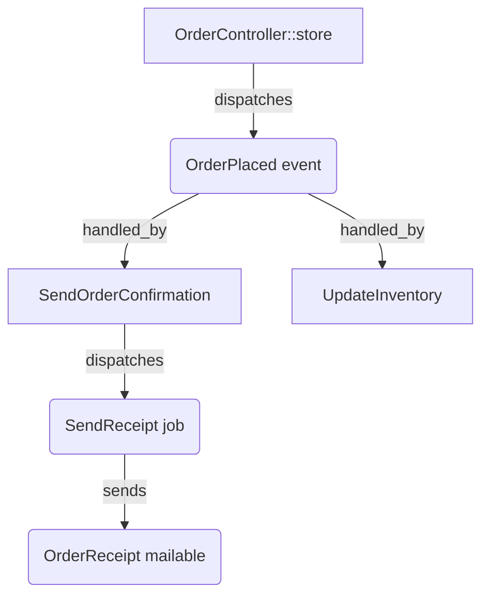

# The index

A scan writes a single JSON document to `storage/loom/index.json`. This page shows you what that document looks like without making you read the full schema — for the field-by-field contract, see the [Schema reference](schema.md).

## The shape of the document

The index opens with metadata and a `stats` block, then carries one array per primitive:

```json
{
  "loom_version": "0.2.0",
  "scanned_at": "2026-05-16T19:25:54Z",
  "laravel_version": "13.7",
  "stats": { "events": 1, "listeners": 2, "jobs": 1, "mailables": 1, "...": "..." },
  "events": [ { "...": "..." } ],
  "model_events": [ { "...": "..." } ],
  "listeners": [ { "...": "..." } ],
  "closure_listeners": [ { "...": "..." } ],
  "jobs": [ { "...": "..." } ],
  "observers": [ { "...": "..." } ],
  "scheduled": [ { "...": "..." } ],
  "mailables": [ { "...": "..." } ],
  "notifications": [ { "...": "..." } ],
  "unresolved_dispatches": [ { "...": "..." } ]
}
```

All keys are always present. Empty arrays are valid; a `null` array never is. Entries are sorted deterministically, so two scans of the same source produce byte-identical output — which is also what lets you compare two indexes with [`loom:diff`](diff.md) and get a stable, order-independent result, or gate on its contents with [`loom:check`](check.md).

## Reading a relationship

The interesting part of the index is how entries point at each other. The relationships are bidirectional but stored once, on whichever side is the natural owner:

- An **event** lists its handlers in `handled_by` — each item is `{listener, method}`.
- A **listener**, **job**, or **observer** lists what it fires in `dispatches` — each item is `{target, kind, confidence, file, line}`.
- An **event** or **job** lists where it's fired from in `dispatched_from`; a **mailable** uses `sent_from`; a **notification** uses `notified_from`. Each item is a dispatch site: `{file, line, method}` (with optional `overrides`, and `channels` for notifications).

So to answer "who handles this event?" you read its `handled_by`. To answer "where is this job dispatched?" you read its `dispatched_from`. You never have to reconcile two copies of the same fact.

## A worked example

Consider one flow: a controller dispatches `OrderPlaced`; two listeners handle it; one of them dispatches a queued `SendReceipt` job; the job sends an `OrderReceipt` mailable.



Here's how the index captures it. The JSON below is **trimmed for illustration** — real entries carry every required field.

The event records who handles it and where it's dispatched from:

```json
{
  "id": "App\\Events\\OrderPlaced",
  "fqcn": "App\\Events\\OrderPlaced",
  "kind": "class",
  "file": "app/Events/OrderPlaced.php",
  "line": 11,
  "dispatched_from": [
    { "file": "app/Http/Controllers/OrderController.php", "line": 42, "method": "App\\Http\\Controllers\\OrderController::store" }
  ],
  "handled_by": [
    { "listener": "App\\Listeners\\SendOrderConfirmation", "method": "handle" },
    { "listener": "App\\Listeners\\UpdateInventory", "method": "handle" }
  ]
}
```

The `SendOrderConfirmation` listener records the job it dispatches:

```json
{
  "fqcn": "App\\Listeners\\SendOrderConfirmation",
  "file": "app/Listeners/SendOrderConfirmation.php",
  "line": 14,
  "handles": [ { "event": "App\\Events\\OrderPlaced", "method": "handle" } ],
  "registration": "auto_discovered",
  "queued": false,
  "dispatches": [
    {
      "target": "App\\Jobs\\SendReceipt",
      "kind": "job",
      "confidence": "high",
      "file": "app/Listeners/SendOrderConfirmation.php",
      "line": 22
    }
  ]
}
```

The job records where it's dispatched from — the listener's `handle()` is the dispatch site:

```json
{
  "fqcn": "App\\Jobs\\SendReceipt",
  "file": "app/Jobs/SendReceipt.php",
  "line": 16,
  "queued": true,
  "queue_config": { "connection": null, "queue": "mail", "delay": null, "tries": 3, "timeout": null, "backoff": null },
  "dispatched_from": [
    { "file": "app/Listeners/SendOrderConfirmation.php", "line": 22, "method": "App\\Listeners\\SendOrderConfirmation::handle" }
  ],
  "dispatches": []
}
```

The mailable records where it's sent from — the job's `handle()`:

```json
{
  "fqcn": "App\\Mail\\OrderReceipt",
  "file": "app/Mail/OrderReceipt.php",
  "line": 18,
  "queued": false,
  "queue_config": null,
  "sent_from": [
    { "file": "app/Jobs/SendReceipt.php", "line": 31, "method": "App\\Jobs\\SendReceipt::handle" }
  ]
}
```

Follow the links: `OrderPlaced.handled_by` names `SendOrderConfirmation`, whose `dispatches` names `SendReceipt`, whose `dispatched_from` points back to that exact `SendOrderConfirmation::handle` site, and `OrderReceipt.sent_from` points to `SendReceipt::handle`. The same flow read forward and backward, with each fact stored once.

## Full reference

- [Schema reference](schema.md) — the complete field-by-field contract for every section.
- [What Loom detects](what-loom-detects.md) — the primitives and how they cross-link, in plain English.
