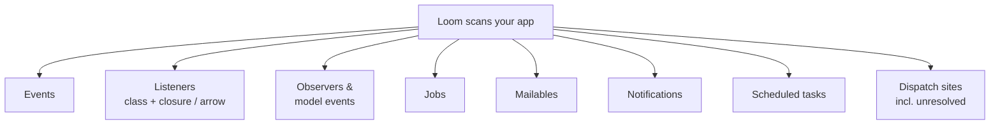
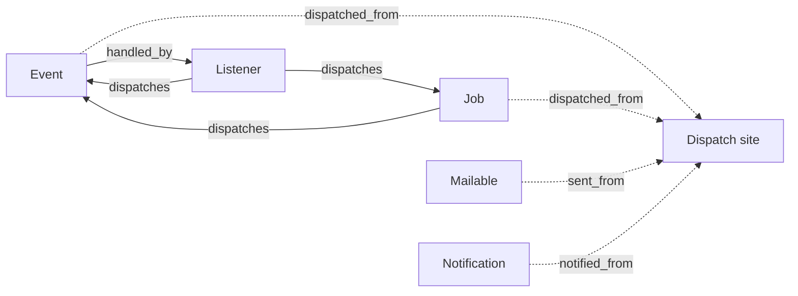

# What Loom detects

Loom scans your `app/` tree (plus `bootstrap/app.php` for the scheduler) and records the event-driven primitives it finds. Each entry carries enough to locate it in source — at minimum a file path and a line number — and the cross-link pass joins related entries together. This page is the plain-English tour; each section links to its deep reference page.

### Events

An event is a class your app dispatches to signal that something happened (`OrderPlaced`, `InvoicePaid`). Loom finds event classes under `app/Events/` and any class dispatched via `event()`, `Event::dispatch()`, or `OrderPlaced::dispatch()`. For each event it records the FQCN, file, and line, plus the listeners that `handle` it and the sites it's `dispatched_from`. See [Events](scanners/events.md).

### Listeners

A listener is a class that reacts to an event, usually through a `handle()` method. Loom discovers listeners four ways: Laravel 11+ auto-discovery via the typed `handle()` argument, the `$listen` array on an `EventServiceProvider`, `listen()` calls on the event dispatcher, and subscribers. The `listen()` form covers both the `Event::listen()` facade and a dispatcher resolved from the container (`app(Dispatcher::class)->listen(...)`, `$this->app['events']->listen(...)`, and similar). For each it records the events and methods it `handles`, how it was registered, whether it's `queued`, and any events or jobs it `dispatches`. See [Listeners](scanners/listeners.md).

In the `$listen` array and in `Event::listen()`, a listener can be written several ways — `SendReceipt::class`, `[SendReceipt::class, 'handle']`, `Closure::fromCallable([SendReceipt::class, 'handle'])`, or the first-class callable `SendReceipt::handle(...)`. As long as it resolves to a real class and method, Loom links it like any other listener; the wrapper syntax doesn't matter.

A few callable forms still slip past, because the target can't be pinned down from source alone: an instance call like `$listener->handle(...)`, a string callable like `'SendReceipt::handle'`, and `Closure::fromCallable($variable)` where the value comes from a variable.

### Closure listeners

Listeners registered as closures or arrow functions (`Event::listen(OrderPlaced::class, fn ($e) => …)`) have no class name to key against, so Loom records them in their own section. Each entry captures the event, the source span of the closure, how it was registered, and any events or jobs it `dispatches`. See [Closure listeners](scanners/closure-listeners.md).

### Observers & model events

An observer reacts to Eloquent lifecycle events (`created`, `updating`, `deleted`). Loom finds them via `Model::observe()`, the `#[ObservedBy]` attribute, and `eloquent.*` event listeners. It records which model each observer watches, which lifecycle `hooks` it implements, and any dispatches inside those hooks. The lifecycle events themselves surface as synthetic `model_events` entries linking each `model` + `event` back to its handlers. See [Observers](scanners/observers.md).

### Jobs

A job is a unit of work, usually queued. Loom finds job classes under `app/Jobs/` and any class dispatched via `dispatch()`, `Bus::dispatch()`, or `ProcessOrder::dispatch()` (located by PSR-4, so DDD layouts work). It records whether the job is `queued`, its declared `queue_config` (connection, queue, delay, tries, timeout, backoff), where it's `dispatched_from`, and what it `dispatches` from its own `handle()`. See [Jobs](scanners/jobs.md).

### Mailables

A mailable is an email class extending `Mailable`. Loom finds them under `app/Mail/` and any class sent via `Mail::send()` / `Mail::to()->send()`. It records whether the mailable is `queued`, its `queue_config`, and the sites it's `sent_from`. See [Mailables](scanners/mailables.md).

### Notifications

A notification is a class delivered over one or more channels (mail, database, Slack). Loom finds them under `app/Notifications/` and any class sent via `notify()` or `Notification::send()`. It records the delivery `channels` from a static `via()` literal, whether those channels are `channels_dynamic`, the `queue_config`, and the sites it's `notified_from`. See [Notifications](scanners/notifications.md).

### Scheduled tasks

A scheduled task is an entry in Laravel's scheduler. Loom reads `Console\Kernel::schedule()`, `bootstrap/app.php` `withSchedule()`, and `Schedule::*` chains. For each it records the `kind` (command, job, closure, exec), the `target`, the frequency normalized to a five-field `cron` expression, the timezone, and any extra `constraints`. See [Scheduled tasks](scanners/schedule.md).

### Dispatch sites & unresolved dispatches

A dispatch site is a call that fires an event, job, mailable, or notification. Loom records each resolvable site and uses it to populate the reverse-reference fields on the target (`dispatched_from`, `sent_from`, `notified_from`). Calls it can't resolve statically — a variable class name, a container lookup, string interpolation, a conditional — aren't dropped; they land in `unresolved_dispatches[]` with a `reason` and a `file:line`. See [Dispatches](scanners/dispatches.md).

## How the index cross-links

Discovery finds the primitives; the cross-link pass connects them. It runs after every scanner has emitted, so it has a complete view, and it writes each relationship into exactly one field.

The solid edges are forward links: an event lists its `handled_by` listeners; a listener, job, or observer lists what it `dispatches`. The dashed edges are reverse links computed from dispatch sites: an event or job carries `dispatched_from`, a mailable carries `sent_from`, and a notification carries `notified_from`, each pointing back to the call sites that fire it. Every one of these is a single source of truth — the relationship lives in exactly one field, not duplicated across both ends.

!!! note "Loom is honest about what it can't see"
    Some dispatches can't be resolved statically — a dynamic class name (`event($var)`), a container lookup, a name built by string interpolation, or a conditional. Rather than silently dropping them, Loom records each in `unresolved_dispatches[]` with a `reason` code and a `file:line` so you can see exactly where the gaps are. See [Dispatches](scanners/dispatches.md).
